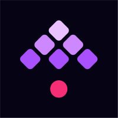
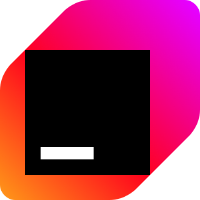
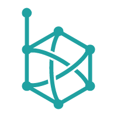
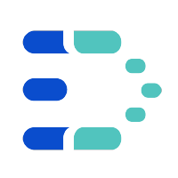
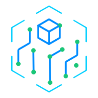

Applications and Projects using OSHI
-------------------
<table style="padding:6px"><tr>
    <td align=center width=134px><a href="https://kestra.io/"> Kestra</a></td>
    <td align=center width=134px><a href="https://www.jetbrains.com/idea/"> IntelliJ IDEA</a></td>
    <td align=center width=134px><a href="https://dolphinscheduler.apache.org/"> Apache Dolphin Scheduler</a></td>
    <td align=center width=134px><a href="https://cassandra.apache.org/"> Apache Cassandra</a></td>
    <td align=center width=134px><a href="https://deeplearning4j.org/"> DeepLearning4J</a></td>
    <td align=center width=134px><a href="https://www.starrocks.com/"> StarRocks</a></td>
  </tr><tr></tr><tr>
    <td align=center width=134px><a href="https://flink.apache.org/"> Apache Flink</a></td>
    <td align=center width=134px><a href="https://calcite.apache.org/"> Apache Calcite</a></td>
    <td align=center width=134px><a href="https://samza.apache.org/"> Apache Samza</a></td>
    <td align=center width=134px><a href="https://doris.apache.org/"> Apache Doris</a></td>
    <td align=center width=134px><a href="https://karaf.apache.org/"> Apache Karaf</a></td>
    <td align=center width=134px><a href="https://github.com/apache/incubator-datalab"> Apache DataLab</a></td>
  </tr><tr></tr><tr>
    <td align=center width=134px><a href="https://www.atlassian.com/software/confluence"> Atlassian Confluence</a></td>
    <td align=center width=134px><a href="https://www.h2o.ai/"> H2O</a></td>
    <td align=center width=134px><a href="https://www.gocd.org/"> GoCD</a></td>
    <td align=center width=134px><a href="https://opentelemetry.io/"> OpenTelemetry Java</a></td>
    <td align=center width=134px><a href="https://github.com/PBH-BTN/PeerBanHelper"> PeerBanHelper</a></td>
    <td align=center width=134px><a href="https://github.com/didi/KnowStreaming"> KnowStreaming</a></td>
  </tr><tr></tr><tr>
    <td align=center width=134px><a href="https://www.minecraft.net"> Minecraft: Java Edition</a></td>
    <td align=center width=134px><a href="https://www.appdynamics.com/"> AppDynamics</a></td>
    <td align=center width=134px><a href="https://www.hivemq.com/"> HiveMQ</a></td>
    <td align=center width=134px><a href="https://github.com/thingsboard/tbmq"> ThingsBoard TBMQ</a></td>
    <td align=center width=134px><a href="https://github.com/besu-eth/besu"> Besu Ethereum Client</a></td>
    <td align=center width=134px><a href="https://github.com/Consensys/teku"> Teku</a></td>
  </tr><tr></tr><tr>
    <td align=center width=134px><a href="https://apereo.github.io/cas"> CAS Server</a></td>
    <td align=center width=134px><a href="https://docs.geoserver.org/stable/en/user/community/status-monitoring/index.html"> GeoServer</a></td>
    <td align=center width=134px><a href="https://github.com/nosqlbench/nosqlbench"> NoSQLbench</a></td>
    <td align=center width=134px><a href="https://github.com/OpenNMS/opennms"> OpenNMS</a></td>
    <td align=center width=134px><a href="https://github.com/datavane/datavines"> Datavines</a></td>
    <td align=center width=134px><a href="https://github.com/PhotonVision/photonvision"> PhotonVision</a></td>
  </tr><tr></tr><tr>
    <td align=center width=134px><a href="https://kamon.io/"> Kamon System Metrics</a></td>
    <td align=center width=134px><a href="https://octopus.com/"> Octopus Deploy</a></td>
    <td align=center width=134px><a href="https://trino.io/"> Trino</a></td>
    <td align=center width=134px><a href="https://www.graylog.org/"> Graylog</a></td>
    <td align=center width=134px><a href="https://vaadin.com/"> Vaadin Platform</a></td>
    <td align=center width=134px><a href="https://github.com/microsoft/ApplicationInsights-Java"> Microsoft App Insights</a></td>
  </tr><tr></tr><tr>
    <td align=center width=134px><a href="https://github.com/tianshiyeben/wgcloud"> WGCLOUD</a></td>
    <td align=center width=134px><a href="https://github.com/WeiYe-Jing/datax-web"> DataX Web</a></td>
    <td align=center width=134px><a href="https://github.com/cym1102/nginxWebUI"> nginxWebUI</a></td>
    <td align=center width=134px><a href="https://github.com/alldatacenter/alldata"> AllData</a></td>
    <td align=center width=134px><a href="https://github.com/mqttsnet/thinglinks"> ThingLinks</a></td>
    <td align=center width=134px><a href="https://github.com/KouShenhai/KCloud-Platform-IoT"> KCloud Platform IoT</a></td>
  </tr><tr></tr><tr>
    <td align=center width=134px><a href="https://github.com/UniversalMediaServer/UniversalMediaServer"> Universal Media Server</a></td>
    <td align=center width=134px><a href="https://github.com/psi-probe/psi-probe"> PSI Probe</a></td>
    <td align=center width=134px><a href="https://jppf.org/"> JPPF</a></td>
    <td align=center width=134px><a href="https://mosip.io/"> MOSIP</a></td>
    <td align=center width=134px><a href="https://www.handle.net/"> Handle.net</a></td>
    <td align=center width=134px><a href="https://cryptolens.io/"> Cryptolens</a></td>
  </tr><tr></tr><tr>
    <td align=center width=134px><a href="https://github.com/erupts/erupt"> Erupt Framework</a></td>
    <td align=center width=134px><a href="https://github.com/Tencent/bk-ci"> BlueKing CI</a></td>
    <td align=center width=134px><a href="https://www.hutool.cn/"> Hutool</a></td>
    <td align=center width=134px><a href="https://github.com/PaperMC/paperweight"> PaperMC</a></td>
    <td align=center width=134px><a href="https://github.com/ErnestOrt/Trampoline"> Trampoline</a></td>
    <td align=center width=134px><a href="https://github.com/sofn/ArchSmith"> ArchSmith</a></td>
  </tr><tr></tr><tr>
    <td align=center width=134px><a href="https://xap.github.io/"> GigaSpaces XAP</a></td>
    <td align=center width=134px><a href="https://github.com/openhab/openhab-addons/tree/main/bundles/org.openhab.binding.systeminfo"> OpenHAB Systeminfo</a></td>
    <td align=center width=134px><a href="https://wiki.jenkins.io/display/JENKINS/Swarm+Plugin"> Jenkins Swarm Plugin</a></td>
    <td align=center width=134px><a href="https://lightstep.com/"> Lightstep</a></td>
    <td align=center width=134px><a href="https://www.gocypher.com/gocypher/"> GoCypher</a></td>
    <td align=center width=134px><a href="https://github.com/hiparker/opsli-boot"> OPSLI</a></td>
  </tr><tr></tr><tr>
    <td align=center width=134px><a href="https://dynamiasoluciones.com/"> DynamiaModules</a></td>
    <td align=center width=134px><a href="https://github.com/tywo45/t-io"> t-io</a></td>
    <td align=center width=134px><a href="https://github.com/CloudSlang/score"> CloudSlang Score</a></td>
    <td align=center width=134px><a href="https://www.alluxio.io/"> Alluxio</a></td>
    <td align=center width=134px><a href="https://github.com/B-Software/Ward"> Ward</a></td>
    <td align=center width=134px><a href="https://github.com/rememberber/MooInfo"> MooInfo</a></td>
</tr></table>
